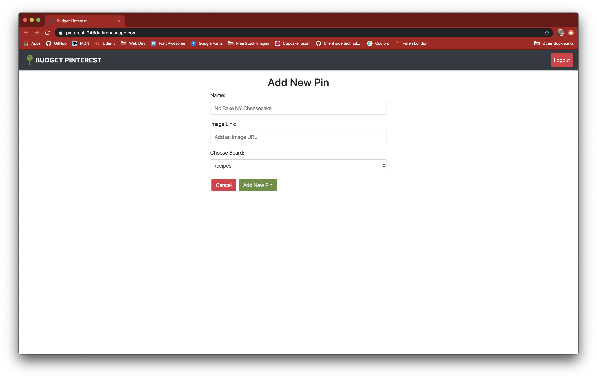

# pinterest

## Technologies
HTML5, SCSS, Bootstrap, Javascript, JQuery, Webpack, Firebase, Axios

## Description
An exercise to reinforce CRUD standards, an introduction to using firebase as a database and axios methods.

## Screenshots

## Instructions
1. Clone down this repo
2. Make sure you have http-server installed via npm. If not get it [HERE](https://www.npmjs.com/package/http-server/)
3. In your command line interface, change directory into the folder that contains your copied files
4. Enter command: `npm install` and wait for completion
5. You will need to create a project using [firebase](https://firebase.google.com/) and use the `apiKeys.example.json` file with the information that is created for you.
6. Enter command: `http-server -p 8080` or `hs -p 8080`
7. The project will now render in your browser at url: http://localhost:8080